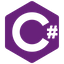

## Hi there 👋
### My name is Thomas! I am a recent bootcamp grad about to start an internship, please feel free to reach out!

  - 🔭 I’m currently working on my capstone project: https://github.com/thomasfriedrichs/crossplay 
  - 🌱 I’m currently focused mastering my React skills
  - 👯 I’m looking to collaborate on any sort of full stack demo sites (restaurant/salon for example)
  - 🤔 I’m looking for help with https://github.com/thomasfriedrichs/crossplay 
  - 💬 Ask me about https://github.com/thomasfriedrichs/crossplay 
  - 📫 How to reach me: friedrichs.tommy@gmail.com
  - 😄 Pronouns: He/Him

### GitHub Stats
  

    
    
  

### Here are some technologies I love to use

            

